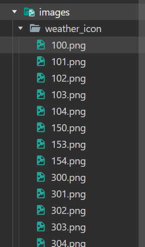
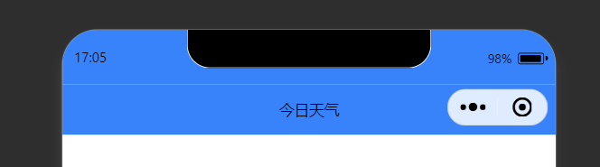
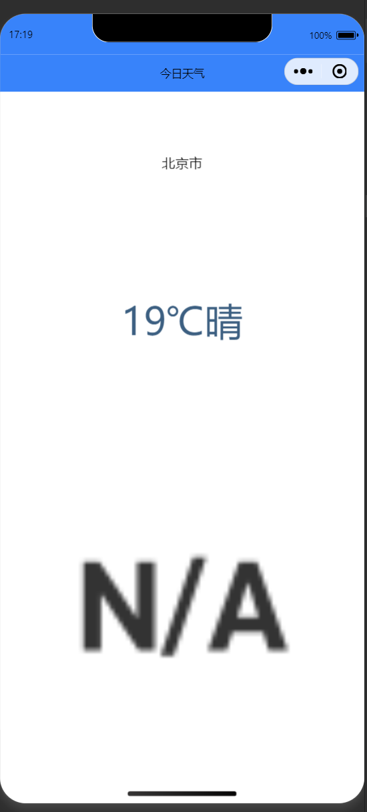
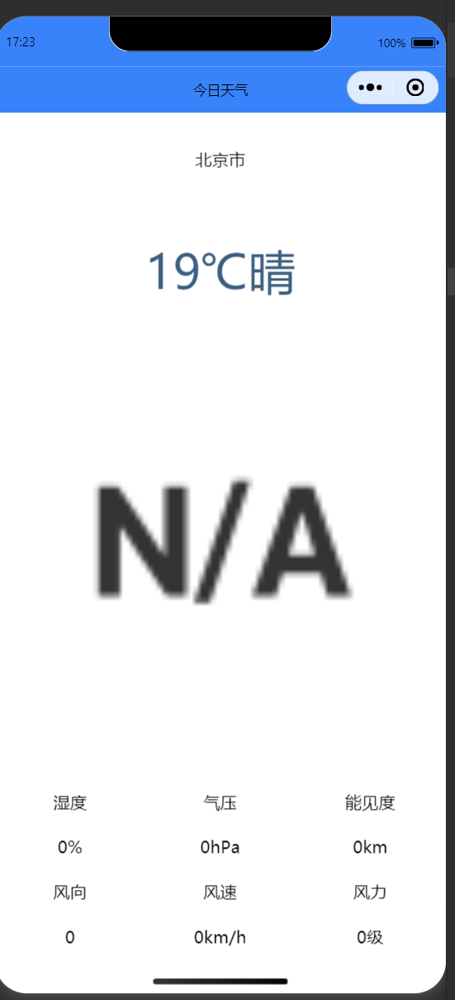
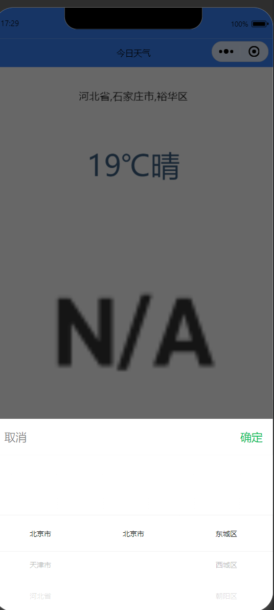
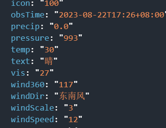
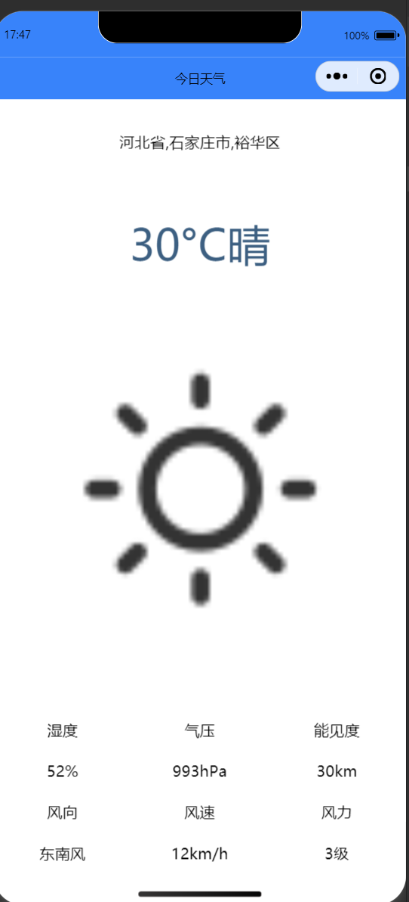
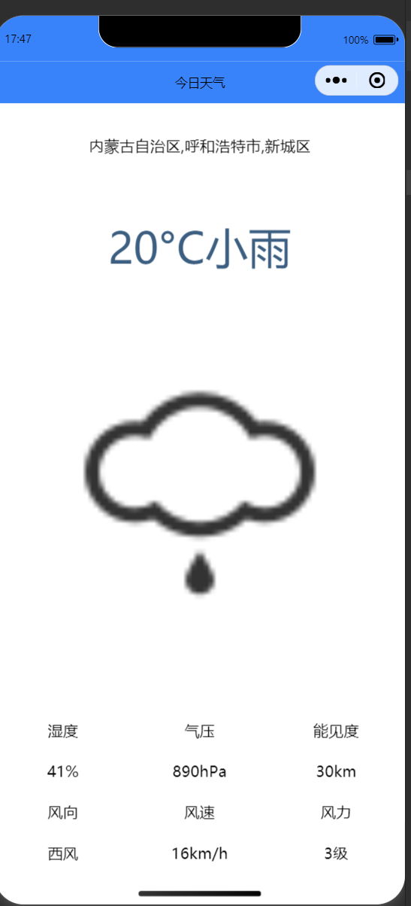

# 2023年夏季《移动软件开发》实验报告


| 姓名和学号？         |                                     |
| -------------------- | ----------------------------------- |
| 本实验属于哪门课程？ | 中国海洋大学23夏《移动软件开发》    |
| 实验名称？           | 实验2：天气查询小程序               |
| 博客地址？           | https://www.cnblogs.com/-tcxm       |
| Github仓库地址？     | https://github.com/tzhcyd/class.git |

（备注：将实验报告发布在博客、代码公开至 github 是 **加分项**，不是必须做的）


## **一、实验目标**

 1、掌握服务器域名配置和临时服务器部署；2、掌握 wx.request 接口的用法。


## 二、实验步骤

#### 1.准备工作

##### 1.1 API秘钥申请

​	登录和风天气官方网址https://www.qweather.com/注册并记录个人认证key


##### 1.2服务器域名配置

​	本次实验需要查询城市ID与该城市所对应天气，故需要配置两个域名，在微信公众平台可以将两个接口添加到“request合法域名“中


#### 2.页面配置

##### 2.1创建页面文件、删除和修改文件

​	根据实验要求对项目中文件进行修改与删除，并在index.js中补全Page函数，在app.js中补全App函数


##### 	2.2创建其他文件

​		在images文件夹中新建二级目录weather_icon，并将图标文件复制粘贴到当前文件夹中



#### 3.视图设计

##### 3.1导航栏设计

​	更改app.json文件代码如下：

```json
{
  "pages":[
    "pages/index/index"
  ],
  "window":{
    "navigationBarBackgroundColor": "#3883FA",
    "navigationBarTitleText": "今日天气",
    "navigationBarTextStyle":"black"
  },
  "style": "v2",
  "sitemapLocation": "sitemap.json"
}
```

​	上述代码可以更改所有页面的导航栏标题文本为”今日天气“，背景颜色为蓝色（#3883FA），效果如图：



##### 3.2页面设计

###### 3.2.1整体容器设计

​	首先定义页面容器view，代码如下：

```html
<view class = 'container'> <view>
```

​	并设计容器样式，代码如下：

```css
/* 背景容器样式*/
.container{
    height : 100vh;
    display: flex;
    flex-direction: column;
    align-items: center;
    justify-content: space-around;
}
```

###### 3.2.2区域1（地区选择器）、2（文本）、3（天气图标）设计

​	使用picker组件可以使用户自行选择省市区，使用text组件实现单行天气信息，包含温度与天气状况，image组件用来展示当前城市的天气图标，代码如下：

```html
<view class = 'container'>
    <!--区域1：地区选择器-->
    <picker mode = 'region' >
        <view>北京市</view>
    </picker>
    <!--区域2：单行天气信息-->
    <text>19℃晴</text>
    <!--区域3：天气图标-->
    <image src = '/images/weather_icon/999.png' mode= 'widthFix'></image>
</view>
```

​	得到效果如图：



###### 3.2.3区域4（多行天气信息）设计

​	使用view组件展示多行天气信息，代码如下：

```html
<!--区域四：多行天气信息-->
    <view class = 'detail'>
        <view class = 'bar'>
            <view class = 'box'>湿度</view>
            <view class = 'box'>气压</view>
            <view class = 'box'>能见度</view>
        </view>
        <view class = 'bar'>
            <view class = 'box'>0%</view>
            <view class = 'box'>0hPa</view>
            <view class = 'box'>0km</view>
        </view>
        <view class = 'bar'>
            <view class = 'box'>风向</view>
            <view class = 'box'>风速</view>
            <view class = 'box'>风力</view>
        </view>
        <view class = 'bar'>
            <view class = 'box'>0</view>
            <view class = 'box'>0km/h</view>
            <view class = 'box'>0级</view>
        </view>
    </view>
```

​	wxss代码：

```css
/*区域4整体样式*/
.detail{
    width:100%;
    display:flex;
    flex-direction: column;
}
/*区域4单元行样式*/
.bar{
    display: flex;
    flex-direction: row;
    margin: 20rpx 0;
}
/*区域4单元格样式*/
.box{
    width: 33.3%;
    text-align: center;
}
```

​	得到效果如图：



#### 4.逻辑实现

##### 4.1更新省、市、区信息

​	修改picker组件中“北京市”为{{region}}，并追加自定义bindchange事件来监听选项变化，代码如下：

```html
<!--区域1：地区选择器-->
    <picker mode = 'region' bindchange = 'regionChange'>
        <view>{{region}}</view>
    </picker>
```

​	在js文件中自定义初始城市信息：

```javascript
region: ["河北省", "石家庄市", "裕华区"],
```

​	效果如图（可以随意切换地址）：



##### 4.2获取实况天气数据

​	    由于和风天气请求实时天气时需请求参数为所查询地区的locationID，而在region数组中存储的内容为文字，故需要调用城市搜索API来获取所查地址ID，请求参数为需要查询地址的名称以及用户认证key。

​	    这里需要使用Promise对象来完成异步任务，当执行成功时将调用resolve函数并传递成功的结果，并使用then来处理Promise成功状态的回调函数，并将ID传递来供实时天气API使用，该API请求参数为用户认证key以及需要查询地区的LocationID，调用成功则将data中数据修改为调用成功后结果。

```java
 getWeather: function () {
        let that = this;
        new Promise((resolve, reject) => {
            wx.request({
                url: 'https://geoapi.qweather.com/v2/city/lookup',
                data: {
                    location: this.data.region[1],
                    key: '23eb2b712c534b0e9cf9fd37bfb43363'
                },
                success: function (res) {
                    resolve(res.data.location[0].id);
                }
            })
        }).then((id) => {
            wx.request({
                url: 'https://devapi.qweather.com/v7/weather/now',
                data: {
                    location: id,
                    key: '23eb2b712c534b0e9cf9fd37bfb43363'
                },
                success: function (res) {
                    console.log(res.data);
                    that.setData({ now: res.data.now });
                }
            })
        })
    },
```

​	调用成功结果如下（可以获取到实时数据）：



##### 4.3更新页面天气信息

​	将wxml页面所有临时数据都替换成{{now.属性}}的形式，代码如下：

```html
<!--区域二：单行天气信息-->
    <text>{{now.temp}}°C{{now.text}}</text>
    <!--区域三：天气图标-->
    <image src = '/images/weather_icon/{{now.icon}}.png' mode = 'widthFix'></image>
    <!--区域四：多行天气信息-->
    <view class = 'detail'>
        <view class = 'bar'>
            <view class = 'box'>湿度</view>
            <view class = 'box'>气压</view>
            <view class = 'box'>能见度</view>
        </view>
        <view class = 'bar'>
            <view class = 'box'>{{now.humidity}}%</view>
            <view class = 'box'>{{now.pressure}}hPa</view>
            <view class = 'box'>{{now.vis}}km</view>
        </view>
        <view class = 'bar'>
            <view class = 'box'>风向</view>
            <view class = 'box'>风速</view>
            <view class = 'box'>风力</view>
        </view>
        <view class = 'bar'>
            <view class = 'box'>{{now.windDir}}</view>
            <view class = 'box'>{{now.windSpeed}}km/h</view>
            <view class = 'box'>{{now.windScale}}级</view>
        </view>
    </view>
```

​	并在js中为now规定初始数据，避免在网速受限的情况下可能不能立刻获取到数据：

```javascript
data: {
        region: ["河北省", "石家庄市", "裕华区"],
        now: {
            temp: "0",
            text: "未知",
            icon: "999",
            humidity: "0",
            pressure: "0",
            vis: "0",
            windDir: "0",
            windSpeed: "0",
            windScale: "0"
        }
    },
```

​	实现结果如下：



## 三、程序运行结果

更新地址前：


更新地址后：



## 四、问题总结与体会

​	    刚进行实验时并没有认真阅读接口文档，在查询实时天气时没有看到所需数据位城市的locationID，只将城市名当做参数传递，出现了问题。本次实验让我掌握了掌握服务器域名配置和临时服务器部署，并且掌握了wx.request接口的用法。同时也了解到了Promise对象的用法，表示一个异步操作，有：Pending（进行中）、resolve（已完成）、rejected（已失败）三种状态，学会了then方法。

​	