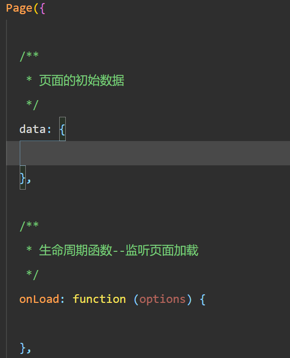
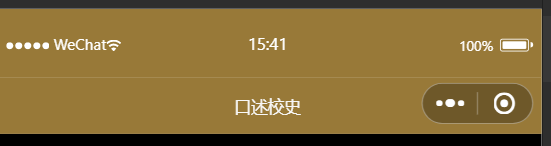

# 2023年夏季《移动软件开发》实验报告

<center>姓名：檀宗晗  学号：21020007087</center>

| 姓名和学号？         | 檀宗晗，21020007087                                          |
| -------------------- | ------------------------------------------------------------ |
| 本实验属于哪门课程？ | 中国海洋大学23夏《移动软件开发》                             |
| 实验名称？           | 实验3：口述校史                                              |
| 博客地址？           | https://www.cnblogs.com/-tcxm                                |
| Github仓库地址？     | https://github.com/tzhcyd/class.git    （在dev分支中有全部三个实验代码） |

（备注：将实验报告发布在博客、代码公开至 github 是 **加分项**，不是必须做的）


## **一、实验目标**

1、掌握视频API的操作方法；2、掌握如何发送随机颜色的弹幕。


## 二、实验步骤

#### 1、页面配置

​	按要求删除文件，并补全page与app函数



​	添加images文件夹并存储图片


#### 2、视图设计

##### 2.1导航栏设计

在app.json添加代码如下：

```json
  "pages":[
    "pages/index/index"
  ],
  "window":{
    "navigationBarBackgroundColor": "#987938",
    "navigationBarTitleText": "口述校史",
    "navigationBarTextStyle":"white"
  },
```

可将所有页面导航栏标题文本为“口述校史”，背景颜色为金棕色，字体颜色为白色，效果图如下：



##### 2.2页面设计

###### 2.2.1区域1（视频组件）设计

wxml代码片段如下：

```html
 <!--区域1：视频播放器-->
 <video id = 'myVideo' controls></video>
```

wxss代码如下：

```css
/* 视频组件样式*/
video {
    width : 100% ;
}
```

可得效果图：


###### 2.2.2区域2（弹幕区域）设计

wxml代码如下：

placeholder可以在输入字段为空时显示提示信息

```html
<!--区域2：弹幕控制-->
 <view class = "danmuArea">
    <input type = 'text' placeholder="请输入弹幕内容"></input>
    <button>发送弹幕</button>
</view>
```

wxss代码如下：

```css
/* 区域2：弹幕样式控制 */
/*2-1弹幕区域样式*/
.danmuArea{
    display: flex; 
    flex-direction: row;
}
/*2-2文本输入框样式*/
input{
    border : 1rpx solid #987938;
    flex-grow : 1; /*扩张多余空间宽度*/
    height : 100rpx;
}
/*2-3按钮样式*/
button{
    color : white;
    background-color: #987938;
}
```

可得效果图：


###### 2.2.3区域3（视频列表）设计

wxml代码如下：

```html
<!--区域3：视频列表-->
<view class = 'videoList'>
    <view class = 'videoBar'>
        <image src = '/pages/images/play.png'></image>

        <text>这是一个测试标题</text>
    </view>
</view>
```

wxss代码如下：

margin为外边距，设置对象四边的外延边距

```css
/*区域3：视频列表区域样式*/
/*3-1视频列表区域样式*/
.videoList{
    width :100%;
    min-height: 400rpx;
}
/*3-2单行列表区域样式*/
.videoBar{
    width:95%;
    display: flex;
    flex-direction: row;
    border-bottom: 1rpx solid #987938;
    margin : 10rpx;
}
/*3-3播放图标样式*/
image{
    width : 70rpx;
    height :70rpx;
    margin: 20rpx;
}
/*3-4文本标题样式*/
text{
    font-size: 45rpx;
    color : #987938;
    margin : 20rpx;
    flex-grow: 1;
}
```

效果如图：


#### 3、逻辑实现

##### 3.1更新播放列表

​	wx:for可以控制属性绑定一个数组，可以使用数组中各项的数据重复渲染该数组，默认数组的当前项的下表变量名默认为index，数组当前项的变量名默认为item；

​	wx:key可以指定列表中项目的唯一标识符

wxml代码如下：

```html
<!--区域3：视频列表-->
<view class = 'videoList'>
    <view class = 'videoBar' wx:for='{{list}}' wx:key="video{{index}}">
        <image src = '/pages/images/play.png'></image>
        <text>{{item.title}}</text>
    </view>
</view>
```

js文件中数据追加list数组如下：

```js
list: [{
        id: '1001',
        title: '杨国宜先生口述校史实录',
        videoUrl: 'http://arch.ahnu.edu.cn/__local/6/CB/D1/C2DF3FC847F4CE2ABB67034C595_025F0082_ABD7AE2.mp4?e=.mp4'
      },
      {
        id: '1002',
        title: '唐成伦先生口述校史实录',
        videoUrl: 'http://arch.ahnu.edu.cn/__local/E/31/EB/2F368A265E6C842BB6A63EE5F97_425ABEDD_7167F22.mp4?e=.mp4'
      },
      {
        id: '1003',
        title: '倪光明先生口述校史实录',
        videoUrl: 'http://arch.ahnu.edu.cn/__local/9/DC/3B/35687573BA2145023FDAEBAFE67_AAD8D222_925F3FF.mp4?e=.mp4'
      },
      {
        id: '1004',
        title: '吴仪兴先生口述校史实录',
        videoUrl: 'http://arch.ahnu.edu.cn/__local/5/DA/BD/7A27865731CF2B096E90B522005_A29CB142_6525BCF.mp4?e=.mp4'
      }
    ]
```

效果如图：


##### 3.2点击播放视频

​	data-url用于记录每行视频对应的播放地址，bindtap用于触发点击事件

wxml代码如下：

```html
<!--区域3：视频列表-->
<view class = 'videoList'>
    <view class = 'videoBar' wx:for='{{list}}' wx:key='video{{index}}' data-url = '{{item.videoUrl}}' bindtap = 'playVideo'>
        <image src = '/pages/images/play.png'></image>
        <text>{{item.title}}</text>
    </view>
</view>
```

​	VideoContext可以通过一个id与video组件绑定，内置方法可以实现播放、暂停、发送弹幕等功能

js修改代码如下：

```js
onLoad: function (options) {
    this.videoCtx = wx.createVideoContext('myVideo')
  },
  /**
   * 播放视频
   */
  playVideo: function (e) {
    //停止之前正在播放的视频
    this.videoCtx.stop()
    //更新视频地址
    this.setData({
        src : e.currentTarget.dataset.url
    })
    //播放新的视频
    this.videoCtx.play()
},
```

运行效果如下：


##### 3.3发送弹幕

​	对video组件添加enable-danmu 和 danmu-btn属性，用于允许发送弹幕和显示“发送弹幕按钮”

wxml代码如下：

```html
<!--区域1：视频播放器-->
 <video id = 'myVideo' src = "{{src}}" controls enable-danmu danmu-btn></video>
 <!--区域2：弹幕控制-->
 <view class = "danmuArea">
    <input type = 'text' placeholder="请输入弹幕内容" bindinput="getDanmu"></input>
    <button bindtap = 'sendDanmu'>发送弹幕</button>
</view>
```

js代码片段修改如下：

```js
/**
   * 更新弹幕内容
   */
  getDanmu: function (e) {
    this.setData({
        danmuTxt : e.detail.value
    })
},

  /**
   * 发送弹幕
   */
  sendDanmu: function (e) {
    let text = this.data.danmuTxt;
    this.videoCtx.sendDanmu({
        text:text,
        color : getRandomColor()
    })
},
```

​	Math.random()可以随机生成0.0-1.0的数，乘256即可实现随机生成0.0~256.0之间的数，Math.floor()可以实现去掉小数位，即可实现生成0~255的整数，再将其使用toString(16)函数将其转换为16进制，三个两位16进制即可组成rgb三原色。

发送彩色弹幕代码如下：

```js
  /**
   * 生成随机颜色
   */
  function getRandomColor () {
    let rgb =[]
    for(let i = 0; i < 3;i++){
        let color = Math.floor(Math.random()*256).toString(16)
        color = color.length == 1 ? '0'+color : color
        rgb.push(color)
    }
    return '#' + rgb.join('')
}
```


## 三、程序运行结果

实现可以播放、暂停视频，并可发送彩色弹幕


## 四、问题总结与体会

​	   本次实验学会了wx:for 以及wx:key的用法，wx:for可以控制属性绑定一个数组，可以使用数组中各项的数据重复渲染该数组，默认数组的当前项的下表变量名默认为index，数组当前项的变量名默认为item；wx:key可以指定列表中项目的唯一标识符。并且掌握了视频API的应用方法以及如何生成随机颜色。同时了解到了VideoContext对象，可以通过一个id与video组件绑定，内置方法可以实现播放、暂停、发送弹幕等功能。还学会了如何生成随机颜色。

​		通过本次实验让我对于微信小程序的理解进一步加深，但仍然还有很多不懂的地方，课下需要加强学习。

​	